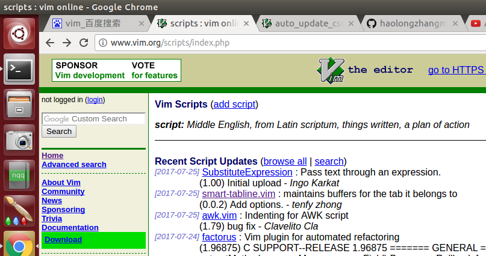

[TOC]

## 获取vimtools
在本站下载或克隆vimtools如：
``` shell
git clone -b master https://SeaflyDennis@github.com/SeaflyDennis/vimtools.git
```

## 安装vimtools
克隆后或下载解压zip之后会多出一个vimtools目录，

    提示：目前(2017)对ubuntu支持会好点

- 1.获取简易安装帮助信息：`./build_all.sh help`  或  `./build_all.sh -h` 或 `./build_all.sh ?`
- 2.完整安装（初次安装推荐）：`./build_all.sh`
- 3.只安装或更新vim：`./build_all.sh vim` 或 `./build_all.sh.sh only_vim`
- 4.只安装或更新脚本插件(xx.vim)：`./build_all.sh scr_plg` 或 `./build_all.sh script_plugin`
- 5.只安装或更新源码插件(需要编译的)：`./build_all.sh src_plg` 或 `./build_all.sh source_plugin`
- 6.只安装或更新配置文件：`./build_all.sh config` 或 `./build_all.sh update_config`

## 快速上手vimtools

### 进入工程环境
- 步骤01：进入目标工程顶层目录，`cd test_proj`
- 步骤02：直接执行`object.sh`命令在当前目录生成工程依赖文件
- 步骤03：启动vim，打开任何一个工程源文件。`vim Makefile`
- 步骤04：启动vim后，分别按F3，F4导入工程依赖文件，F3，F4分别类似如下vim命令：
        `:set tags=tags,filenametags,~/.vim/systags`
        `:cscope add cscope.out ./`

至此，我们成功进入工程环境，接下来我们就可以使用vim管理该工程了。


# vimtools用户手册

## 各种窗口模式

- 垂直分割窗口：`Ctrl-w v`
- 水平分割窗口：`Ctrl-w s`
- 窗口之间跳转切换：`Ctrl-w [h,j,k,l]`
- 该窗口打开一个文件：`:edit src2.c`
- winmanager窗口模式：按`F12`进入该窗口模式，再按`F12`退出该窗口模式
- sourceinsight窗口模式：按`F8`进入该窗口模式，再按`F8`退出该窗口模式

- F1~F12的功能
    - F1    --系统默认键,我们不动他
    - F2    --绑定了插入文件头功能,即按F2即可插入文件头
    - F3    --导入cscope生成的工程数据库文件,前提是执行了object.sh
    - F4    --导入ctags生产的taglist依赖文件,前提是执行了object.sh
    - F5    --执行LookupFile插件来查找文件,前提是执行了object.sh
    - F6    --闲置
    - F7    --闲置
    - F8    --启动sourceinsight窗口模式,前提是执行了object.sh
    - F9    --闲置
    - F10   --闲置
    - F11   --闲置
    - F12   --启动winmanager窗口模式,前提是执行了object.sh

- 常用快捷键
    - cl    --ESC模式下直接输入cl即可删除所有空行
    - cs    --ESC模式下直接输入cs即可删除所有行尾空格和行尾制表符
    - cm    --ESC模式下直接输入cm即可删除所有行尾^M符(Windows中的回车换行符)

- 快速编辑代码的常用操作

    - https://github.com/mbbill/code_complete
    - code_complete使用说明:
    - 输入函数名后在输入(，然后按tab键就可以显示函数行参
    - if，while，switch等，输入这些关键字后，直接按tab键就行
    - 输入in后按tab，就是#include " "
    - 输入is后按tab，就是#include < >
    - 输入main后按tab，就是上图所示的那样，main函数就好了
    - 输入cc后按tab，就是上图中的注释
    - 输入ff后按tab，就是上图中的头文件，预处理宏
    - 输入de后按tab，就是宏定义
    - Ctrl + c         --(按V选中)批量注释
    - Ctrl + x         --(按V选中)批量取消注释
    - Ctrl + a         --全选(模仿Windos编辑习惯)

- 文件头的配置
    - 编辑~/.vimrc相应位置即可

E-mail:seafly0616@qq.com

# vimtools开发手册

## vimtools结构简介

- 首先你得有一定vim操作基础，要求基础不多，只要有就行
- 该强化包支持Ubuntu操作系统,仅适用于PC用户(需要root权限)
- build_all.sh      --> 安装时候第一个执行的安装脚本
- config/           --> 该目录里以object.sh,vimrc.vim为核心
- vim/              --> 该目录存放vim源码包(用于离线安装)
- doc/              --> 该目录存放用户手册(README.md的PDF版:)
- plugin/           --> 该目录存放vim插件
- plugin/script/    --> 该目录存放各种vimscript类型的插件
- plugin/source/    --> 该目录存放需要编译的插件
- plugin/script/besides/    --> 该目录存放准备但还没集成到vimtools的插件

## build_all.sh主程结构

1. 获取操作系统类型:HOSTOS
2. 检查用户权限:SUDO
3. 获取python主分支版本号(2.x):PY_VERSION
4. 获取网络连接状态:network_connected
5. 安装python库
6. 通过switch语句读取用户命令参数来分别执行各自子函数
7. 最后执行完毕退出脚本

## config/vimrc.vim

- 简介：即.vimrc配置文件,这里为了省事集成太多特性(虽然这样不好,以后版本中可能分散管理,毕竟集权主义不好)
- vimrc基础技能列表：
    - 绑定快捷键执行函数:map <F6> :call RunCode()<CR>
    - 绑定组合键: nnoremap %s/\s\+$//g <c-c>s
    - [Vim中的键映射参考页](http://www.cnblogs.com/softwaretesting/archive/2011/09/28/2194515.html)
    - 习惯 vim 本来的按键，然后在此基础上增加功能是个不错的习惯。大部分用户也是遵循这个传统。
    - 一般来说使用vim的人，不喜欢覆盖vim本来的键绑定。尤其是非常基本的按键。
    - 如何添加新vimscript插件
        - git或[vimscript官网](http://www.vim.org/scripts/index.php)获取新插件,重新打包使其解压后直接包含.vim或plugin
            目录
        - 新插件添加后如果有配置信息就写入config/vimrc.vim文件的适当位置并注明
            插件信息
**测试图片**


- F1~F12的功能绑定(闲置键可以绑定新功能也能测试新功能)
    - F1    --系统默认键,我们不动他
    - F2    --绑定了插入文件头功能,即按F2即可插入文件头
    - F3    --导入cscope生成的工程数据库文件,前提是执行了object.sh
    - F4    --导入ctags生产的taglist依赖文件,前提是执行了object.sh
    - F5    --执行LookupFile插件来查找文件
    - F6    --闲置
    - F7    --闲置
    - F8    --启动sourceinsight窗口模式
    - F9    --闲置
    - F10   --闲置
    - F11   --闲置
    - F12   --启动winmanager窗口模式


E-mail:seafly0616@qq.com
