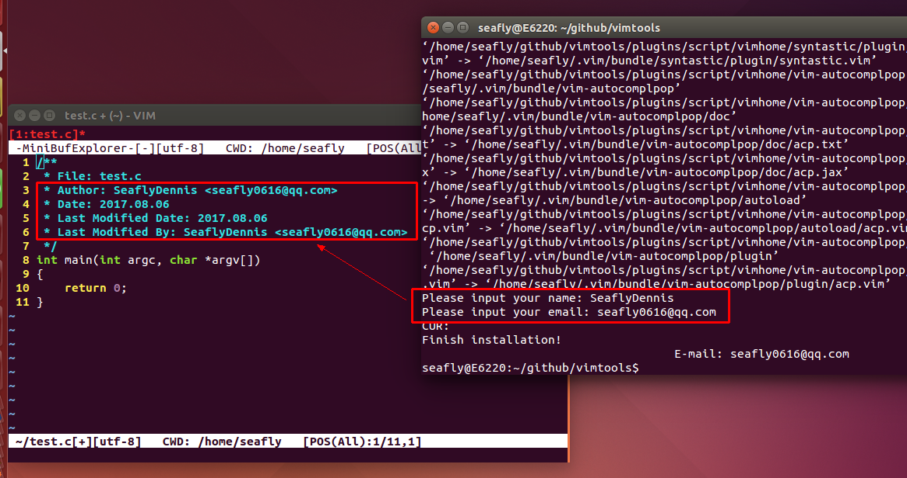
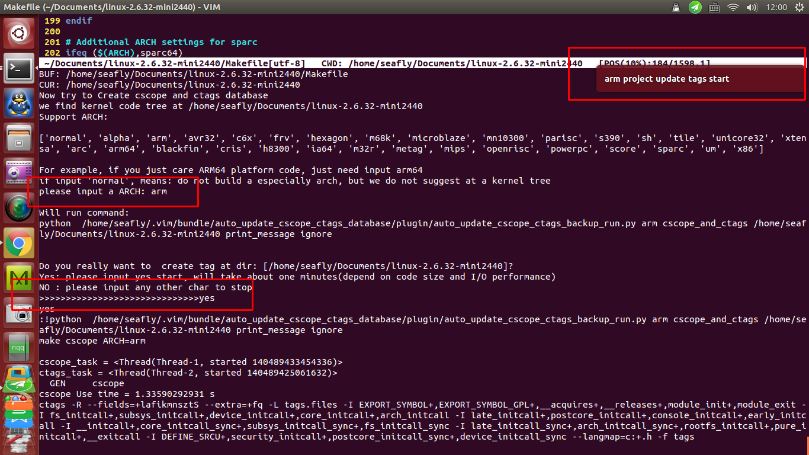
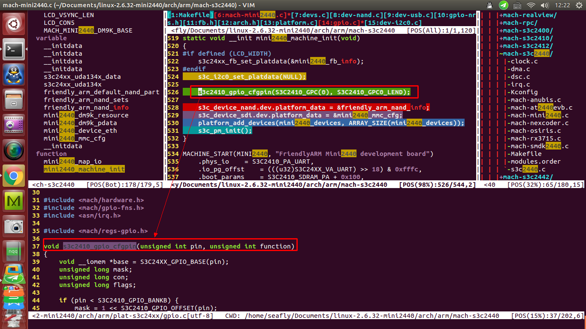

[TOC]

- [Get vimtools](#get-vimtools)
- [Install vimtools](#install-vimtools)
- [Power on vimtools](#power-on-vimtools)
- [Power on vimtools](#power-on-vimtools)
- [vimtools user manual](#vimtools-user-manual)
- [Thanks following vim plugins](#thanks-following-vim-plugins)

# Get vimtools

    git clone -b vimtools-ubuntu https://SeaflyDennis@github.com/SeaflyDennis/vimtools

# Install vimtools

1. Get into directory: `cd vimtools`
2. Get simple help: `./build_all.sh --help` or `./build_all.sh ?` or `./build_all.sh -h`
3. Install: `./build_all all`

Install vimtools screenshot:

# Power on vimtools

1. Get into your project root directory: such as `cd linux-2.6.39`
2. Open a arbitrary source file with vim: such as `vim Makefile`
3. Run vim command: `ESC` + `:Createtag`
4. Enjoy yourself !    --(Press F8 power on/off sourceinsight Layout)

**After running `:Createtag` screenshot:**

**View Linux Kernel code with sourceinsight Layout Screenshot:**

# vimtools user manual

[./doc/vimtools_users_manual.md](https://github.com/SeaflyDennis/vimtools/blob/vimtools-ubuntu/doc/vimtools_users_manual.md)

# Thanks following vim plugins:

|Author                 |Plugin                     |Website                            |
| :-------		        | :-------			        |:-------				            |
|haolongzhangm          |auto_update_cscope_ctags_database|https://github.com/haolongzhangm/auto_update_cscope_ctags_database |
|YouCompleteMe          |Valloric                   |https://github.com/Valloric/YouCompleteMe |
|skywind3000            |asyncrun.vim               |https://github.com/skywind3000/asyncrun.vim |
|SeaflyDennis           |auto_update_cscope_ctags_database|https://github.com/SeaflyDennis/auto_update_cscope_ctags_database |
|马冬亮(凝霜  Loki)     |code_complete              |https://github.com/SeaflyDennis/code_complete |
|fholgado               |minibufexpl.vim            |https://github.com/fholgado/minibufexpl.vim |
|vim-scripts            |minibufexplorerpp.vim      |https://github.com/vim-scripts/minibufexplorerpp/blob/master/plugin/minibufexplpp.vim |
|scrooloose             |nerdtree                   |https://github.com/scrooloose/nerdtree |
|wesleyche              |SrcExpl                    |https://github.com/wesleyche/SrcExpl |
|wesleyche              |Trinity                    |https://github.com/wesleyche/Trinity |
|alpertuna              |vim-header                 |https://github.com/alpertuna/vim-header |
|honza                  |vim-snippets               |https://github.com/honza/vim-snippets |
|Yggdroot               |indentLine                 |https://github.com/Yggdroot/indentLine |
|plasticboy             |vim-markdown               |https://github.com/plasticboy/vim-markdown |
|terryma                |vim-multiple-cursors       |https://github.com/terryma/vim-multiple-cursors |
|honza                  |vim-snippets               |https://github.com/honza/vim-snippets |
|SirVer                 |ultisnips                  |https://github.com/SirVer/ultisnips |
|Tuxdude                |mark.vim                   |https://github.com/Tuxdude/mark.vim |
|vim-scripts            |genutils                   |https://github.com/vim-scripts/genutils |
|vim-syntastic          |syntastic                  |https://github.com/vim-syntastic/syntastic |
|vim-scripts            |winmanager                 |https://github.com/vim-scripts/winmanager--Fox |
|csliu                  |a.vim                      |https://github.com/csliu/a.vim |
|jlanzarotta            |bufexplorer                |https://github.com/jlanzarotta/bufexplorer |
|sudar                  |comments.vim               |https://github.com/sudar/comments.vim |
|vim-scripts            |LookupFile                 |https://github.com/vim-scripts/lookupfile |
|vim-scripts            |OmniCppComplete            |https://github.com/vim-scripts/OmniCppComplete |
|vim-scripts            |taglist.vim                |https://github.com/vim-scripts/taglist.vim |
|vim-scripts            |AutoComplPop               |https://github.com/vim-scripts/AutoComplPop |
|othree                 |vim-autocomplpop           |https://github.com/othree/vim-autocomplpop |
|exvim                  |ex-autocomplpop            |https://github.com/exvim/ex-autocomplpop |
|scrooloose             |nerdtree                   |https://github.com/scrooloose/nerdtree |
|scripts                |CodeCommenter              |http://www.vim.org/scripts/script.php?script_id=3941 |
