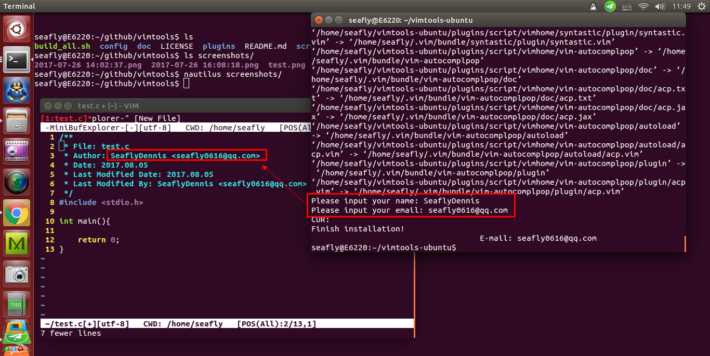
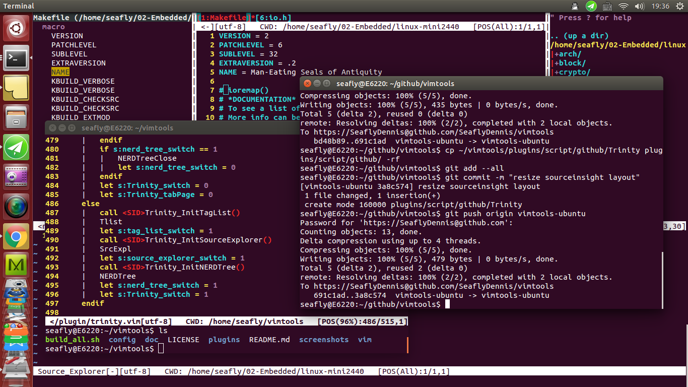
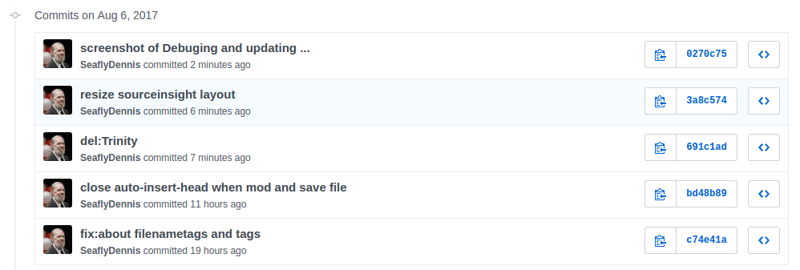
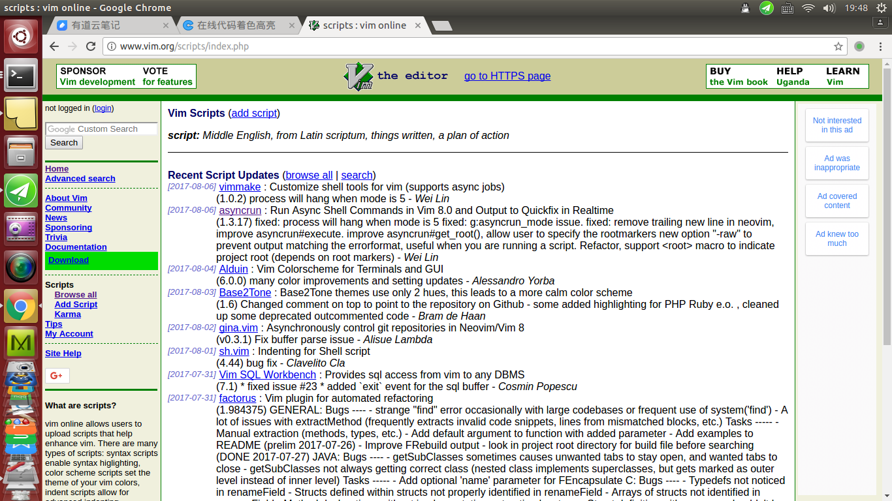
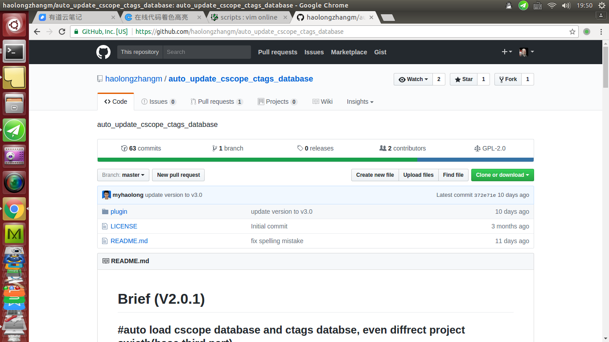

[TOC]

## Get vimtools
``` shell
git clone -b vimtools-ubuntu https://SeaflyDennis@github.com/SeaflyDennis/vimtools
```

## Install vimtools
- 0.Into directory: `cd vimtools`
- 1.Get simple help: `./build_all.sh --help` or `./build_all.sh -h` or `./build_all.sh ?`
- 2.Install: `./build_all.sh all`

Install vimtools screenshot:


## usage of vimtools

### Build object environment of vim
- step01: into project root directory:`cd test_proj`
- step02: run vim and open a source file, such as `vim Makefile`
- step03: run vim normal command `:Createtag`
- step04: enjoy yourself!    --(F8)

After, we can manage our object with vim.

**After running `:Createtag` screenshot:**


**View Linux Kernel code with sourceinsight Layout Screenshot:**


# vimtools user's manual


## Process of development and debuging screenshots:

plugins-modfied-screenshot.png


github_areaof_commits.png


vimhome_online_scripts_website.png


auto_update_cscope_ctags_database_github_home_pange.png

